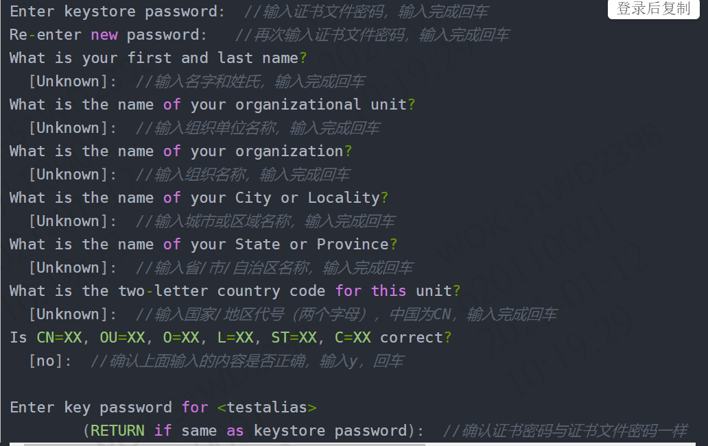
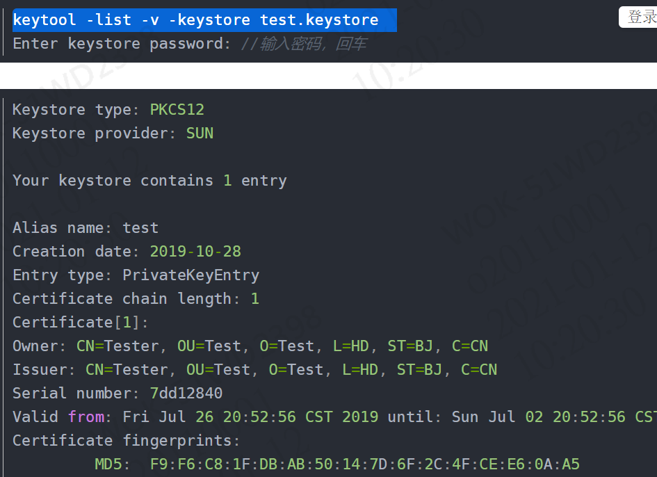
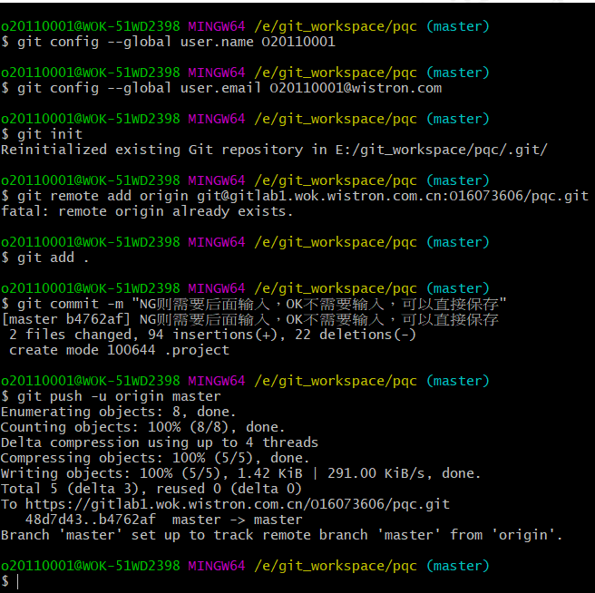
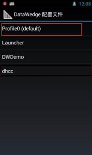
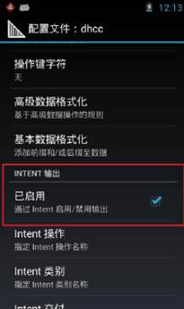
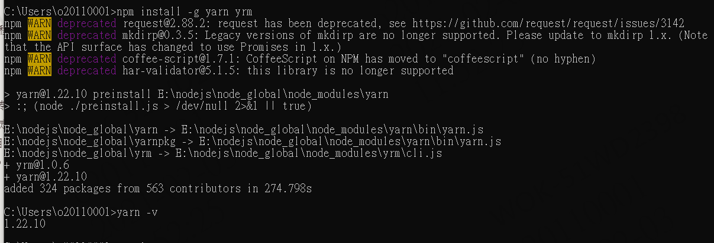
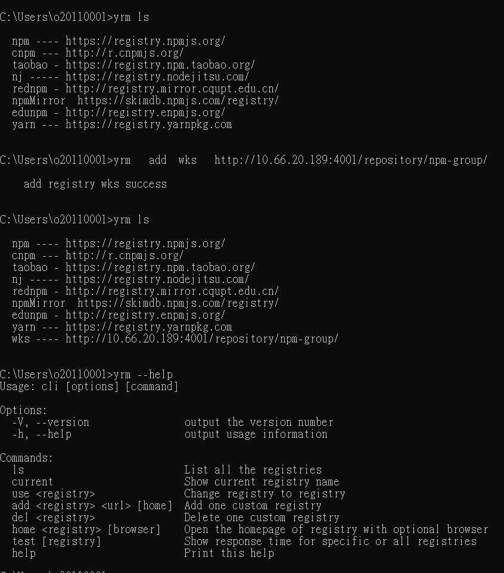

### SQL代码：

###设置主键自增从1开始

```
TRUNCATE TABLE 表名
```

####条件查询  条件显示：

```sql
select  form_id,(CASE WHEN file_type = 'O' THEN '外來文件' when file_type='G' then '技術文件' ELSE 'ISO文件' END) || '-' ||  (case when file_name is null then '' else file_name end)  as form_name,
            (case when router_stage2 = '0' then '新增'
                    when router_stage2 = '1' then '變更' else '作廢' end)as form_type,
             (case  when router_stage = '0' then '開立'
                    when router_stage = '1' then '送簽中'
                    when router_stage = '2' then '結案'
                    else '作廢' end) as form_state,
            create_user as form_employ,create_date as form_date
        from flow_system.flow_maintain_isofiles
```


### cmd方式结束进程

​		1、查看进程

```
netstat -ano | findstr 8080
```


​		2、结束进程

​	

```
	taskkill /F /PID 15716
```


### app重新打包  

1、到10.57.30.111上

打开hbuilderX

发行-云打包

生成安卓证书（需要有jre的环境）

==使用keytool -genkey命令生成证书：==

```
keytool -genkey -alias patrol -keyalg RSA -keysize 2048 -validity 36500 -keystore patrol.keystore
```



testalias是证书别名，可修改为自己想设置的字符，建议使用英文字母和数字
test.keystore是证书文件名称，可修改为自己想设置的文件名称，也可以指定完整文件路径

查看证书信息：

```
keytool -list -v -keystore test.keystore  
```



云打包配置：

**1>证书别名：生成证书时使用-alias参数设置的证书别名；
2>私钥密码：生成证书时使用的keystore密码；
3>证书文件：生成证书时使用-keystore参数设置的证书保存路径；**

**打包完成自动返回下载地址，点击链接下载APP安装

2、到10.57.30.102上

放C:\02.Website\API\TMP 文件夹里 改名PQC.apk

### PQC下载

[‎2021/‎1/‎26 下午 04:58] Mango W Wang/WOK/Wistron: 

http://10.57.30.102:801/download.html  PQC下载链接 " Download PQC"选项

 

### git提交代码

```shell
Command line instructions
You can also upload existing files from your computer using the instructions below.


Git global setup
git config --global user.name "Mango W Wang"
git config --global user.email "o20110001@wistron.com"

Create a new repository
git clone git@gitlab1.wok.wistron.com.cn:O20110001/e-pratol.git
cd e-pratol
touch README.md
git add README.md
git commit -m "add README"
git push -u origin master

Push an existing folder
cd existing_folder
git init
git remote add origin git@github.com:wyh136136/notes.git
git add .
git commit -m "Initial commit"
git push -u origin master

Push an existing Git repository
cd existing_repo
git remote rename origin old-origin
git remote add origin git@gitlab1.wok.wistron.com.cn:O20110001/e-pratol.git
git push -u origin --all
git push -u origin --tags
```


鼠标右键打开git bash here:
<1>输入git config --global [user.name](http://user.name/) “你的用户名”
<2>输入git config --global user.email “你的邮箱”
<3>输入git init
<4>输入git remote add origin 你刚才建立的项目连接

```
<5>输入git add .
<6>输入git commit -m “注释”
```

<7>输入git config http.postBuffer 524288000 (特别提醒: 此行是在本地设置缓存, 有些项目文件较大, 使用http无法上传,可设置此命令)

```
<8>输入git push -u origin master 将代码推送到gitlab端
```



```
git remote add origin https://github.com/wyh136136/spingcloud2021.git
git branch -M master
git push -u origin master
git config --system http.sslcainfo "E:/Git/mingw64/ssl/certs/ca-bundle.crt"  
```

```css
##angular更改单独模块的样式

:host ::ng-deep{
  .ant-table-thead>tr>th {
    color: white;
    /* font-weight: bolder; */
    background: #143f8d;
    border-bottom: 1px solid #e8e8e8;
    -webkit-transition: background 0.3s ease;
    transition: background 0.3s ease;
  }
      a {
        color: #190996;
        text-decoration: none;
      }
     
}
#####angular自定义样式

```
:host ::ng-deep {
  .ant-tabs-large > .ant-tabs-nav .ant-tabs-tab {
    padding: 16px 40px;
    font-size: 16px;
  }
}
#####angularTab组件切换应用
```
<page-header></page-header>
<nz-card [nzBordered]="true">
  <nz-card-tab>
    <nz-tabset nzSize="large" (nzSelectChange)="change($event)">
      <nz-tab nzTitle="工單類型維護" style="margin-right: 100px"></nz-tab>
      <nz-tab nzTitle="工單負責人維護" width="200px"></nz-tab>
      <nz-tab nzTitle="料號段別對照信息維護" width="200px"></nz-tab>
      <nz-tab nzTitle="工作日及假日維護" width="200px"></nz-tab>
    </nz-tabset>
  </nz-card-tab>
  <div [se-container]="1" style="margin-bottom: 3%">
    <div nz-row nzGutter="24">
      <nz-col nzXs="24" nzSm="12" nzMd="8" nzLg="8">
        <se>
          <button nz-button (click)="uploadExcel.click()" nzType="primary" style="background-color: rgba(112, 98, 172, 0.938); border: 0">
            excel文件上傳
          </button>
          <input #uploadExcel type="file" id="uploadExcel" hidden="hidden" (change)="readExcel($event)" />
        </se>
      </nz-col>
      <nz-col nzXs="24" nzSm="12" nzMd="8" nzLg="8">
        <se>
          <button
            id="download"
            (click)="download()"
            nz-button
            nzType="primary"
            style="background-color: rgba(245, 171, 12, 0.938); border: 0"
          >
            下载模板
          </button>
        </se>
      </nz-col>
    </div>
  </div>
  <!-- 工單類型維護 -->
  <div id="workorderType" style="display: block">
    <st #st [columns]="typeColumns" [data]="datas"></st>
  </div>
  <!-- 工單負責人維護 -->
  <div id="workorderPrincipal" style="display: none">
    <st #st [columns]="PrincipalColumns" [data]="datas"></st>
  </div>
  <!-- 料號段別對照信息維護 -->
  <div id="partNumber" style="display: none">
    <st #st [columns]="partNumberColumns" [data]="datas"></st>
  </div>
  <!-- 工作日及假日維護 -->
  <div id="workdayAndholiday" style="display: none">
    <st #st [columns]="workdayColumns" [data]="datas"></st>
  </div>
</nz-card>
```
import { HttpParams } from '@angular/common/http';
import { Component, OnInit, ViewChild } from '@angular/core';
import { STColumn, STComponent } from '@delon/abc/st';
import { _HttpClient } from '@delon/theme';
import { NzMessageService } from 'ng-zorro-antd/message';
import { NzTabChangeEvent } from 'ng-zorro-antd/tabs';
import { webApiUrls } from 'src/services/webApiUrls';
import * as XLSX from 'xlsx';
@Component({
  selector: 'app-mo',
  templateUrl: './mo.component.html',
  styleUrls: ['./mo.component.less'],
})
export class MoComponent implements OnInit {
  @ViewChild('st', { static: false })
  st: STComponent | undefined;
  index: any;
  datas: any = [];
  queryurl: any;
  inserturl: any;
  q: any;
  downloadurl: any;
  uploadData: any = [];
  typeColumns: STColumn[] = [
    { title: 'xxx', index: 'xxx' },
  ];
  mylist: any = [];
  constructor(private http: _HttpClient, private msg: NzMessageService) {}

  ngOnInit() {
    this.index = 0;
    this.queryurl = webApiUrls.mo.moTypeQuery;
    this.inserturl = webApiUrls.mo.moTypeInsert;
    this.query(this.queryurl);
  }
  change(args: NzTabChangeEvent) {
    this.index = args.index;
    console.log(args.index, '******');
    this.changTab(this.index);
  }
  // 内容显示隐藏
  isShow(id: string, isnone: any) {
    const item = document.getElementById(id);
    if (item) {
      item.style.display = isnone;
    }
  }
  readExcel(evt: Event) {
    const target: DataTransfer = <DataTransfer>(<unknown>evt.target);
    if (target.files.length !== 1) throw new Error('Cannot use multiple files');
    const reader: FileReader = new FileReader();
    reader.onload = (e: any) => {
      /* read workbook */
      const bstr: string = e.target.result;
      const wb: XLSX.WorkBook = XLSX.read(bstr, { type: 'binary' });

      /* grab first sheet */
      const wsname: string = wb.SheetNames[0];
      const ws: XLSX.WorkSheet = wb.Sheets[wsname];

      /* save data */
      this.uploadData = XLSX.utils.sheet_to_json(ws, { header: 1 });
      var data = this.tojson(this.uploadData);
      console.log(data);
      var obj;
      if (data != null) {
        obj = eval(data);
      }
      if (this.uploadData != null) {
        // const params = new HttpParams().set('objs',this.uploadData);
        // console.log(params);
        this.http.post(this.inserturl, obj).subscribe((res) => {
          if (res.status == 200) {
            this.msg.success('上傳成功！');
            this.query(this.queryurl);
          } else if (res == 100) {
            this.msg.warning('文件中存在空數據，請及時修改！');
            this.query(this.queryurl);
          } else this.msg.error('上傳失敗！');
        });
      }
      if (evt != null) {
        if (evt.target != null) {
          (<HTMLInputElement>evt.target).value = ''; //清空
        }
      }
    };
    reader.readAsBinaryString(target.files[0]);
  }

  tojson(arr: any[]) {
    if (!arr.length) return null;
    var i = 0;
    var len = arr.length;
    var array = [];
    for (i = 1; i < len; i++) {
      if (this.index == 0) {
        array.push({
          plant: arr[i][0],
          motype: arr[i][1],
          seg: arr[i][2],
          modesc: arr[i][3],
          kpi: arr[i][4],
          createdate: arr[i][5],
        });
      }
    }
    return JSON.stringify(array);
  }
  query(url: any) {
    this.http.get(this.queryurl).subscribe((res) => {
      console.log(res.data);
      this.datas = res.data;
    });
  }

  //切换菜单
  changTab(index: any) {
    if (index === 0) {
      this.queryurl = webApiUrls.mo.moTypeQuery;
      this.inserturl = webApiUrls.mo.moTypeInsert;
      this.isShow('workorderType', 'block');
      this.isShow('workorderPrincipal', 'none');
      this.isShow('partNumber', 'none');
      this.isShow('workdayAndholiday', 'none');
      this.query(this.queryurl);
    }
   
  }
  download() {
    console.log('================');
    const a = document.createElement('a');
    if (this.index == 0) {
      this.downloadurl = '../../../../../assets/tmp/xxx.xlsx';
    }
    a.href = this.downloadurl;
    //  a.download=''
    a.click();
  }
}


相同点：在启动类上面添加 @EnableDiscoveryClient、@EnableEurekaClient 这二个注解作用，都可以让该服务注册到注册中心上去。

不同点：@EnableEurekaClient 只支持Eureka注册中心，@EnableDiscoveryClient 支持Eureka、Zookeeper、Consul 这三个注册中心。


### postgresql日期转换

```
函数	                      返回类型	          描述	               例子
to_char(timestamp, text)	text	 把时间戳转换成字串	  	 to_char(current_timestamp, 'HH12:MI:SS')
to_char(interval, text)	    text	 把时间间隔转为字串	to_char(interval '15h 2m 12s', 'HH24:MI:SS')
to_char(int, text)	        text	          把整数转换成字串	to_char(125, '999')
to_char(double precision, text)	text	   把实数/双精度数转换成字串	to_char(125.8::real, '999D9')
to_char(numeric, text)	  text	把numeric转换成字串	to_char(-125.8, '999D99S')
to_date(text, text)	date	把字串转换成日期	to_date('05 Dec 2000', 'DD Mon YYYY')
to_timestamp(text, text)	timestamp	把字串转换成时间戳	to_timestamp('05 Dec 2000', 'DD Mon YYYY')
to_timestamp(double)	timestamp	把UNIX纪元转换成时间戳	to_timestamp(200120400)
to_number(text, text)	numeric	把字串转换成numeric	to_number('12,454.8-', '99G999D9S')
```


用WinScp登陸10.57.30.45（賬號密碼smartfactory），端口默認22，進入目錄/home/smartfactory/www/assets，配置文檔config.json，新加項目參考其中已存在的。


### PDA掃碼廣播設定

\1.   啟動DataWedge


\2.   點擊Profile0(default)



\3.   找到INTENT輸出並勾選通過Intent啟用/禁用輸出



4.設置Intent操作(區分大小寫)   android.intent.action.SCANRESULT


### 重启angular项目

1、cd到项目目录中

2、

```
pm2   start  "ng serve -- port   端口号" --name   名称：端口号
```

```
pm2 start "ng serve"   查看开启的进程
```

### Ant Design Pro配置环境

1、环境

```
安装yrm

​```
npm  install -g   yarn  yrm
​```

查看版本

​```
yarn -v
​```

查看镜像源   

​```
yrm ls
​```

添加镜像源 

​```
yrm   add  xxx   http://10.66.20.189:4001/repository/npm-group/
​```

使用指定镜像源   
yrm  use  xxx
​```````````
删除镜像源
yrm  delete xxx
​`````````````````
查看命令
yrm --help
```





```
创建项目
yarn create umi/npm create umi
​`````````

```

### Angular处理时间格式    

```
// 對日期進行處理

 dateFormatter(date) {

  const result = new Date(date);

  let date1: any = result.getDate();

  let month: any = result.getMonth() + 1;

  if (date1 < 10) {

   date1 = "0" + date1;

  }

  if (month < 10) {

   month = "0" + month;

  }

  return result.getFullYear() + '-' + month + '-' + date1;

 }
 //2021-02-06
```

### java下载Excel编码问题

```
//文件名只有数字和字母等，中文不见了。
 //解决方式           response.setContentType("application/x-msdownload");
            response.setHeader("Content-Disposition", "attachment; filename=" + URLEncoder.encode(excelname, "UTF-8"))
```

github.com/lycHub/ng-wyy/tree/master/src
